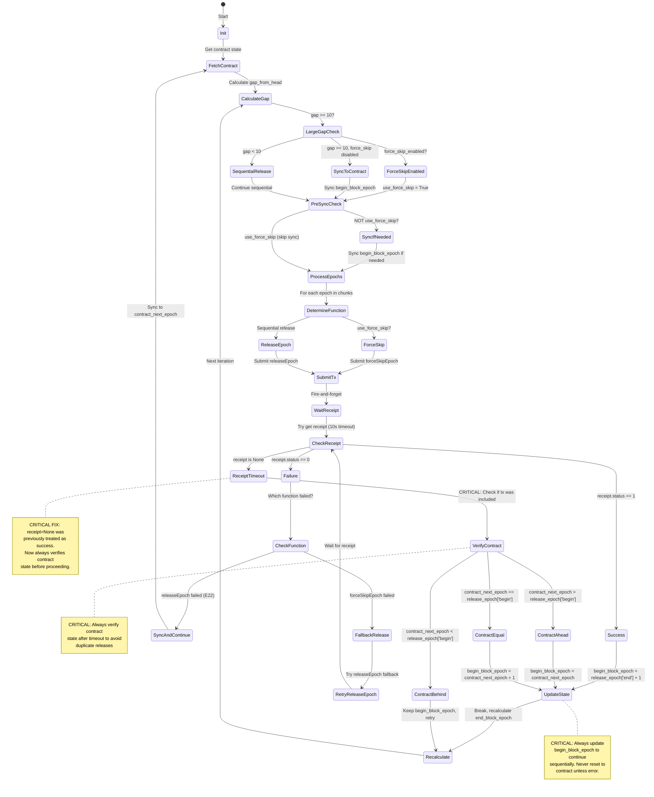

# Epoch Release State Machine Diagram



## State Transitions

### Normal Flow (Sequential Release)
```
CalculateGap → SequentialRelease → ProcessEpochs → ReleaseEpoch → 
SubmitTx → WaitReceipt → Success → UpdateState → Recalculate → CalculateGap
```

### Catch-Up Flow (Large Gap, Sequential)
```
CalculateGap → LargeGapCheck → SyncToContract → PreSyncCheck → 
SyncIfNeeded → ProcessEpochs → ReleaseEpoch → SubmitTx → Success → 
UpdateState → Recalculate → CalculateGap (repeat until caught up)
```

### Jump Flow (Large Gap, Force Skip)
```
CalculateGap → LargeGapCheck → ForceSkipEnabled → PreSyncCheck → 
ProcessEpochs → ForceSkip → SubmitTx → WaitReceipt → Success/Timeout → 
VerifyContract → UpdateState → Recalculate → CalculateGap
```

### Error Recovery Flow
```
AnyError → VerifyContract → UpdateState → Recalculate → CalculateGap
```

## Critical Paths

### Path 1: Successful Sequential Release
1. Calculate gap (gap < 10)
2. Sync to contract if needed (once)
3. Process epochs sequentially
4. Submit releaseEpoch(N)
5. Get receipt (status=1)
6. Update begin_block_epoch = N+1
7. Break, recalculate end_block_epoch
8. Repeat

### Path 2: Catch-Up After Gap
1. Calculate gap (gap >= 10)
2. Sync begin_block_epoch to contract_next_epoch
3. Process epochs sequentially from contract_next_epoch
4. Submit releaseEpoch(N), releaseEpoch(N+1), ...
5. After each success: begin_block_epoch = N+1, N+2, ...
6. Continue until gap < 10

### Path 3: Force Skip Recovery
1. Calculate gap (gap >= 10, force_skip enabled)
2. Set use_force_skip = True
3. Submit forceSkipEpoch to head
4. If timeout: Verify contract state
5. If included: Update begin_block_epoch
6. Continue sequentially

## Invariants to Maintain

1. **begin_block_epoch >= contract_next_epoch** (never release existing epochs)
2. **After success: begin_block_epoch = release_epoch['end'] + 1** (sequential continuation)
3. **After error: begin_block_epoch = contract_next_epoch** (sync to contract)
4. **Nonce always fetched from chain** (never increment locally)
5. **After timeout: verify contract state** (don't assume transaction failed)
